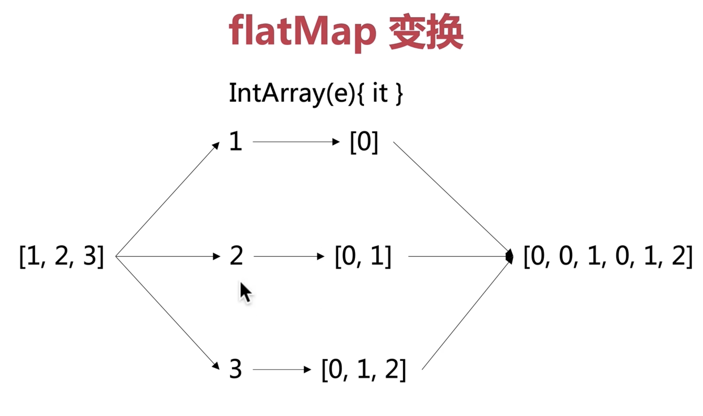

集合变换与序列

java 或者 kotlin 中的 forEach 函数不能 使用 continue 和 break 


java,需要 java 10 才可支持
```
list.forEach((e) ->{
    if(e == 2){
        return
    }
    System.out.println(e)
})
```

kotlin 中的使用
```
list.forEach{
    if(it == 2){
        // return@forEach 相当于 跳出这一次的内联函数调用
        return@forEach 
    }
    println(it)
}
```


# 集合的映射操作举例
> kotlin 中 list.asSequence() 类似 java 中的 list.stream()；

> list.asSequence() 作用是转换为懒序列；

filter 保留满足条件的元素； 

map 集合中的所有元素一一映射到其他元素构成新集合；

flatMap 集合中的所有元素一一映射到新集合后 合并 这些集合到新集合；

<br/>

##  **filter**

是从一个集合到另一个集合的变换，中间应用一个函数；

java 中写法
```
list.stream().filter(e -> e % 2 == 0)
```


kotlin 中写法 

```
val list = listOf(1, 2, 3, 4)
list.filter{it % 2 == 0}

// asSequence() 转换为懒序列
list.asSequence()
    .filter{it % 2 == 0}
```

打印结构为
```
2, 4
```

这两种写法的区别：

第一种 操作是饿汉式；

第二种操作（ asSequence() ）是懒汉式；

 
<br/>

## **map**

一一映射，中间经历高阶函数对应的 lambda 表达式；也可以说是
把里面的每个元素映射成新的元素，这些元素组成的集合就是新的集合作为结果。


java 中写法
```
list.stream().map(e -> e * 2 +1)
```


kotlin 中写法 

```
val list = listOf(1, 2, 3, 4)
list.map{it * 2 + 1}

// asSequence() 转换为懒序列
list.asSequence()
    .map{it * 2 + 1}
```

执行结果为

```
3, 5, 7, 9
```


举两个例子：

**java 中**

```
// java 中的 懒序列
 var list = new ArrayList<Integer>();
 list.addAll(Arrays.asList(1, 2, 3, 4));
 list.stream()
     .filter(e -> {
         System.out.println("filter: " + e);
         return e % 2 == 0;
     })
     .map(e -> {
         System.out.println("map: " + e);
         return e * 2 + 1;
     })
     .forEach(e -> {
         System.out.println("forEach: " + e);
     });
```
执行顺序 
```
filter: 1
filter: 2
map: 2
forEach: 5
filter: 3
filter: 4
map: 4
forEach: 9

```

forEach() 在这里就相当于一个阀门，阀门开了，就从上往下流；没有 forEach()
这个操作 的话，前面函数都不会执行；


**kotlin 中**（和上面 java 中的执行顺序一样）

```
// kotlin 中的 懒序列
val list = listOf(1,2,3,4)
list.asSequence()
    .filter {
        println("filter: $it")
        it % 2 == 0
    }.map {
        println("map: $it")
        it * 2 + 1
    }.forEach {
        println("forEach: $it")
    }
```
执行顺序 
```
filter: 1
filter: 2
map: 2
forEach: 5
filter: 3
filter: 4
map: 4
forEach: 9
```

另外 在 kotlin 中，如果去掉 asSequence() 后执行顺序（也就是 饿汉式 的）

```
// kotlin 中的 懒序列
val list = listOf(1,2,3,4)
list.filter {
        println("filter: $it")
        it % 2 == 0
    }.map {
        println("map: $it")
        it * 2 + 1
    }.forEach {
        println("forEach: $it")
    }
```
执行顺序 
```
filter: 1
filter: 2
filter: 3
filter: 4
map: 2
map: 4
forEach: 5
forEach: 9
```
forEach() 在这里就相当于一个阀门，阀门开了，就从上往下流；没有 forEach()
这个操作 的话，前面都不会执行，也就是没有任何打印；


<br/>

## **flatMap**

flatMap，先把集合打平，然后执行某一个操作，每个元素再映射得到另外一个集合，最后把每个元素得到的集合
做一次拼接，得到新的集合；


##  **sum 、reduce、fold**
sum 所有元素求和

reduce 将元素依次按规则聚合，结果与元素类型一致

fold 给定初始化值，将元素按规则聚合，结果与初始化值类型一致；另外还有 foldRight,是从右往左


 


 


